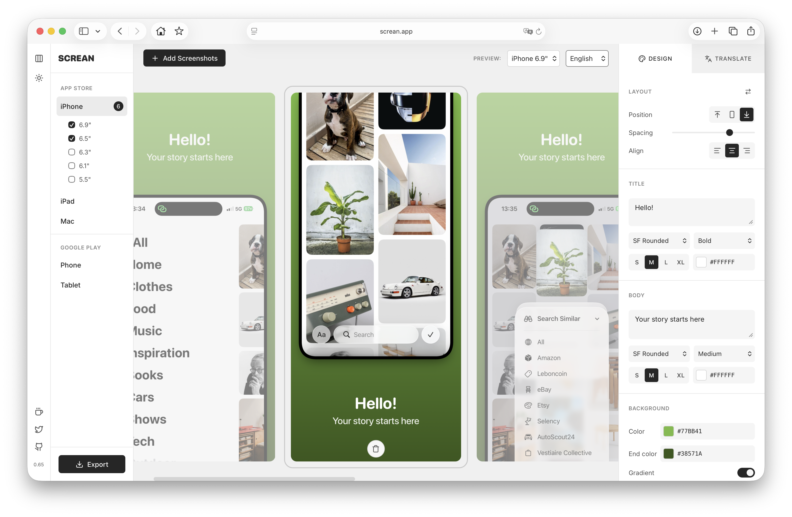
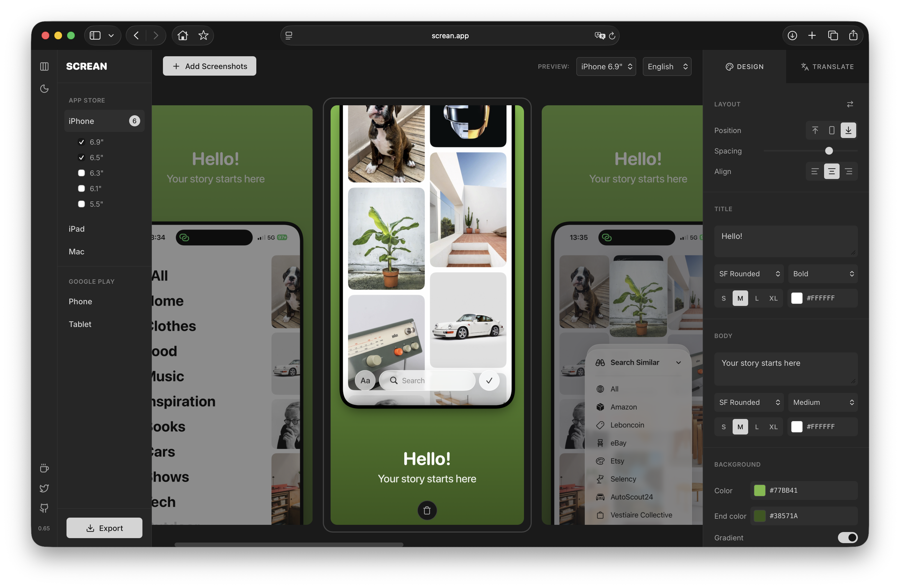

# Screan

**Screenshot Studio for App Store & Google Play**

Create beautiful, localized screenshots for your app store listings. No account, no upload — everything runs in your browser.

[**Try it live at screan.app**](https://screan.app)

## Screenshots

<p align="center">
  
  
</p>

## Features

- **All store formats** — iPhone, iPad, Mac, Android Phone & Tablet in every required size
- **Layout presets** — Top, Center, Bottom positioning with adjustable spacing
- **Customizable design** — Fonts, colors, gradients, device frames, shadows
- **Multi-language** — Add languages and export localized screenshots in one click
- **AI translation** — Automatic translation powered by Claude API (optional)
- **ZIP export** — Export all formats and languages at once
- **Persistent storage** — Your work is saved locally in IndexedDB
- **Dark/Light mode** — Automatic theme support
- **No backend** — Everything runs client-side, your data stays in your browser

## Supported Formats

| App Store | Google Play |
|-----------|-------------|
| iPhone 6.9", 6.7", 6.5", 6.3", 6.1", 5.5" | Phone FHD (1080p), QHD (1440p) |
| iPad 13", 12.9", 11" | Tablet 7", 10" |
| Mac 2880, 1280 | |

## Usage

1. Select your target platform (iPhone, iPad, Mac, Android)
2. Drag & drop your screenshots or click to add
3. Pick a layout preset (Top, Center, Bottom)
4. Customize title, subtitle, colors and fonts
5. Add languages and translate (manually or with AI)
6. Select which device sizes to export
7. Click **Export** to download a ZIP with all formats

## AI Translation

Screan includes optional AI translation powered by Claude:

1. Enter your Claude API key in the Translate tab (stored locally, never sent anywhere except Anthropic)
2. Add a new language from the dropdown
3. Click the translate button to translate all screenshots at once

## Tech Stack

Pure HTML, CSS, and JavaScript. No build step, no frameworks.

- **JSZip** — ZIP export
- **Lucide Icons** — UI icons
- **Claude API** — AI translation (optional)

## Development

No build required. Just serve the files:

```bash
python3 -m http.server 8000
# or
npx serve .
```

Then open `http://localhost:8000` in your browser.

## Contributing

This is a personal project. The code is open-source for transparency and learning purposes, but I'm not accepting contributions at this time.

## License

[MIT](LICENSE)
